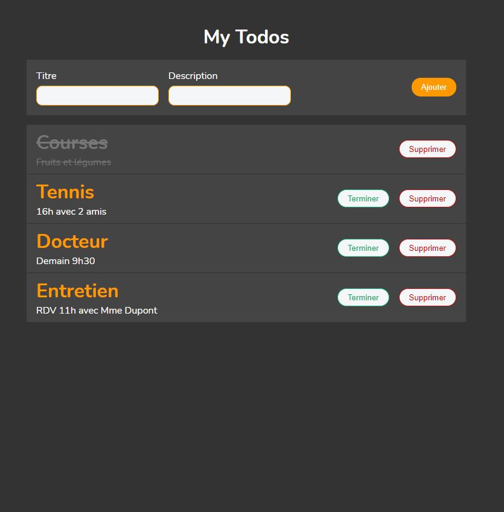

# My Todo
It's a list of tasks you need to complete, or things that you want to do.
Application without authentification fullstack MERN with Typescript

## Image application

## API
`yarn watch` --> for typescript to update in real time the dist folder

`yarn dev` --> to start nodemon (a tool that helps develop node.js based applications by automatically restarting the node application when file changes in the directory are detected)

`yarn build` --> to build the dist folder

## WEB

### Getting Started with Create React App

This project was bootstrapped with [Create React App](https://github.com/facebook/create-react-app).

### `yarn start`

Runs the app in the development mode.\
Open [http://localhost:3000](http://localhost:3000) to view it in the browser.

The page will reload if you make edits.\
You will also see any lint errors in the console.

### `yarn test`

Launches the test runner in the interactive watch mode.\
See the section about [running tests](https://facebook.github.io/create-react-app/docs/running-tests) for more information.

### `yarn build`

Builds the app for production to the `build` folder.\
It correctly bundles React in production mode and optimizes the build for the best performance.

The build is minified and the filenames include the hashes.\
Your app is ready to be deployed!

See the section about [deployment](https://facebook.github.io/create-react-app/docs/deployment) for more information.

### `yarn eject`

**Note: this is a one-way operation. Once you `eject`, you can’t go back!**

If you aren’t satisfied with the build tool and configuration choices, you can `eject` at any time. This command will remove the single build dependency from your project.

Instead, it will copy all the configuration files and the transitive dependencies (webpack, Babel, ESLint, etc) right into your project so you have full control over them. All of the commands except `eject` will still work, but they will point to the copied scripts so you can tweak them. At this point you’re on your own.

You don’t have to ever use `eject`. The curated feature set is suitable for small and middle deployments, and you shouldn’t feel obligated to use this feature. However we understand that this tool wouldn’t be useful if you couldn’t customize it when you are ready for it.

## Learn More

You can learn more in the [Create React App documentation](https://facebook.github.io/create-react-app/docs/getting-started).

To learn React, check out the [React documentation](https://reactjs.org/).

## Database
1/ Don't forget to put your nodemon.json in your src folder in api

    MONGO_DB
    PORT
    APP_BASE_URL
    API_BASE_URL 
    
2/ Don't forget to put your .env in your src folder in Web

    REACT_APP_API_BASE_URL

## Dependencies

**NodeJs :** an open-source, cross-platform, back-end JavaScript runtime environment

**Express :** a minimal and flexible Node.js web application framework that provides a robust set of features for web and mobile applications

**TypeScript :** an open-source language which builds on JavaScript, one of the world’s most used tools, by adding static type definitions

**Mongoose :** Mongoose is a Node. js based Object Data Modeling (ODM) library for MongoDB.

**MongoDB :** MongoDB is an open-source document-oriented database. It is used to store a larger amount of data and also allows you to work with that data. MongoDB is not based on the table-like relational database structure but provides an altogether different mechanism for storage and retrieval of data, that’s why known as NoSQL database. Here, the term ‘NoSQL’ means ‘non-relational’. The format of storage is called BSON ( similar to JSON format).

**Nodemon :** a tool that helps develop node.js based applications by automatically restarting the node application when file changes in the directory are detected

**Dotenv :** a module that loads environment variables from a .env file into process.env, we used it to store confidential variables

